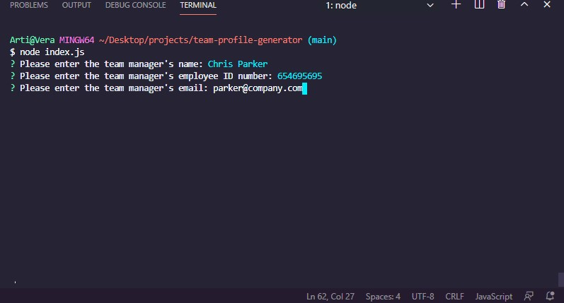
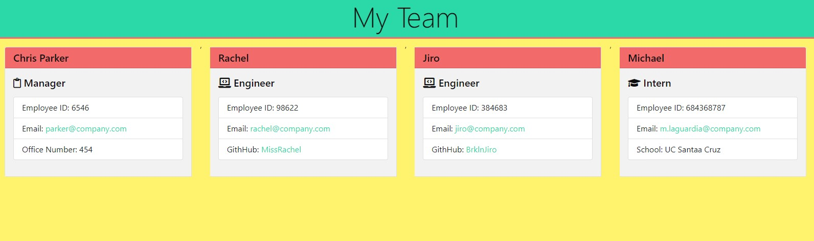
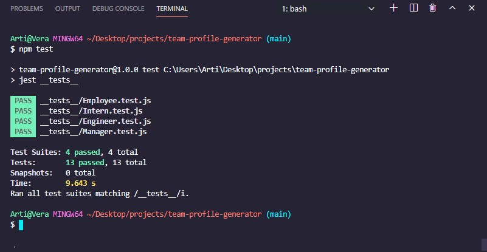

# Team Profile Generator

A command line application using [inquirer](https://www.npmjs.com/package/inquirer) to quickly and easily build a profile page for your team!  
  
  
  
Runs through a series of questions and uses the answers and the various classes (Employee, Manager, Engineer, and Intern) to generate cards with easily accessible contact info for each team member. Includes name, employee ID number, email, office number (for Manager), GitHub username (for Engineers), and school (for Interns).  
  
  
  
As each team member is generated using inquirer questions, the object goes into an array. A function then iterates through the array to make a card for each employee and pushes the HTML for the card to another array. This does leave a comma between each card in the finished product, but this doesn't affect the functionality. Email info goes into a mailto link, and GitHub links open in a new tab.  
Color scheme was born of challenging myself to not make yet another monochrome blue/gray webpage.  
  
  
  
Classes and their behavior were tested with [jest](https://jestjs.io/). 

[Demo Video](https://www.youtube.com/watch?v=PPpkn2tIxgk)